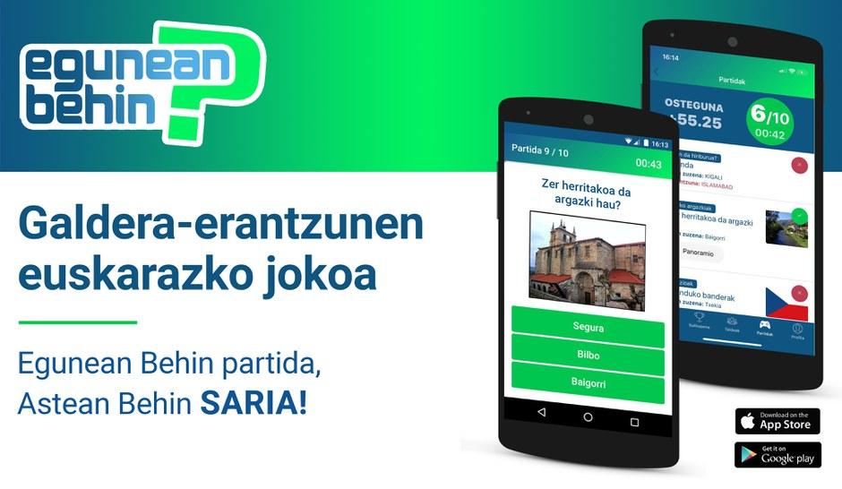

# Egunean Behin Visual Question Answering Dataset

This is a Visual Question Answering dataset based on questions from the game [Egunean Behin](https://www.codesyntax.com/eu/proiektuak/egunean-behin). Egunean Behin is a popular Basque quiz game. The game consists on answering 10 daily multiple choice questions. Appart from the questions from the game, more types of questions were generated for each image.

Questions were translated to English because VQA models are mainly trained on English questions. Questions could easily be translated to other languages.

Three types of questions from the game were selected: figures, cubes and maze. All the images are artificially generated. There are multiple questions for each image. Each question has one correct and two wrong answers. This can be used for multiple choice questions.

This dataset can be used to test VQA models in an out of domain setting. It could also be used to fine-tune a model to answer these types of questions if enough data is generated. The code can be used to generate as many images as necessary.