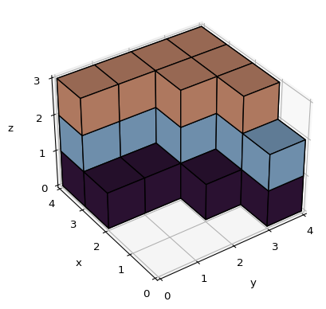

# Cubes

The aim of this code is to generate questions about counting cubes in 3 dimenssion images. See example images in folder `images` and questions in `questions.csv`.

## Create virtual environment

Although it is optional to create a virtual environment, it is a good idea to use a different environment (Conda or Virtualenv) to avoid problems with your system's Python environment. In this case, using virtualenv creates and activates a new environment.

```bash
python3 -m venv myvenv
source myvenv/bin/activate
```

Various libraries are used to create images and perform various operations. To install these, run the following.

```bash
pip install -r requirements.txt
```

## Create images

The library `matplotlib` is used to create 3 dimenssion images that contain cubes. The size of the image is controlled with parameters `x_len`, `y_len` and `z_len`. Cubes are stacked on top of each other with a probability of `prob`. Cubes in each layer are colored with the selected `colormap`. Images are saved in `output_path`. We can select the number of images that we want to generate with parameter `n`. These are the default parameters:

```bash
python sortu_figurak.py \
--x_len 4 \
--y_len 4 \
--z_len 3 \
--n 100 \
--prob 0.75 \
--max_repeats 20 \
--colormap random \
--output_path images
```

For example, the name for the following image is `fig_4_4_3_0002_0013_1133_3333.png`.



## Create questions

Questions are created for each image created previously in `image_path`. The data for the questions is obtained from the filename. Questions and correct answers are generated using this data. Wrong answers are created randomly based on the correct answer. A random integer in a range close to the correct answer is selected. Questions are saved in the `filename` csv file. These are the default parameters:

```bash
python create_questions.py \
--image_path images \
--filename questions.csv
```

Many questions of different types are created for each image. The number of questions depends on the dimenssions of the image.

- 3 questions about total, visible and non visible cubes.
- `x_len` questions about number of cubes in each x layer.
- `y_len` questions about number of cubes in each y layer.
- `z_len` questions about number of cubes in each z layer.

For example, these are the generated questions for the previous image.

| type  | question                     | correct | wrong1 | wrong2 | image                             |
| ----- | ---------------------------- | ------- | ------ | ------ | --------------------------------- |
| Cubes | How many cubes in total?     | 26      | 22     | 21     | fig_4_4_3_0002_0013_1133_3333.png |
| Cubes | How many visible cubes?      | 17      | 16     | 11     | fig_4_4_3_0002_0013_1133_3333.png |
| Cubes | How many non visible cubes?  | 9       | 13     | 10     | fig_4_4_3_0002_0013_1133_3333.png |
| Cubes | How many cubes in layer x 1? | 2       | 0      | 1      | fig_4_4_3_0002_0013_1133_3333.png |
| Cubes | How many cubes in layer x 2? | 4       | 3      | 6      | fig_4_4_3_0002_0013_1133_3333.png |
| Cubes | How many cubes in layer x 3? | 8       | 11     | 10     | fig_4_4_3_0002_0013_1133_3333.png |
| Cubes | How many cubes in layer x 4? | 12      | 15     | 13     | fig_4_4_3_0002_0013_1133_3333.png |
| Cubes | How many cubes in layer y 1? | 4       | 6      | 7      | fig_4_4_3_0002_0013_1133_3333.png |
| Cubes | How many cubes in layer y 2? | 4       | 3      | 1      | fig_4_4_3_0002_0013_1133_3333.png |
| Cubes | How many cubes in layer y 3? | 7       | 9      | 8      | fig_4_4_3_0002_0013_1133_3333.png |
| Cubes | How many cubes in layer y 4? | 11      | 8      | 13     | fig_4_4_3_0002_0013_1133_3333.png |
| Cubes | How many cubes in layer z 1? | 11      | 10     | 12     | fig_4_4_3_0002_0013_1133_3333.png |
| Cubes | How many cubes in layer z 2? | 8       | 4      | 11     | fig_4_4_3_0002_0013_1133_3333.png |
| Cubes | How many cubes in layer z 3? | 7       | 11     | 10     | fig_4_4_3_0002_0013_1133_3333.png |
