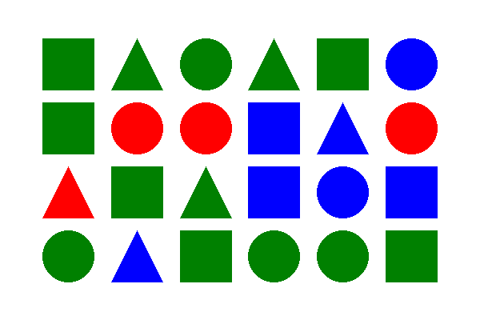

# Figures

The key is to create images of a size that can be clearly seen on your mobile, in which you can insert a number of geometric figures in different colors. Questions require counting figures of one form or another, with the correct answer as well as two incorrect ones. See example images in folder `images` and questions in `questions.csv`.

## Create virtual environment

Although it is optional to create a virtual environment, it is a good idea to use a different environment (Conda or Virtualenv) to avoid problems with your system's Python environment. In this case, using virtualenv creates and activates a new environment.

```bash
python3 -m venv myvenv
source myvenv/bin/activate
```

Various libraries are used to create images and perform various operations. To install these, run the following.

```bash
pip install -r requirements.txt
```

## Create images

To create these questions we have used the Python Image Library (`PIL`). The size of the image is 600 x 400. There are 3 types of figures (triangle, squares, circle) and 3 colors (red, green and blue).

`x_len * y_len` random figures and colors will be drawn in the image. The radius of the figures is controlled with the parameter `r`. We can select the number of images that we want to generate with parameter `n`. These are the default parameters:

```bash
python create_images.py \
--x_len 6 \
--y_len 4 \
--r 32 \
--n 100 \
--output_path images
```

Images will be saved to `output_path` with a name that contains all the necessary data to create questions. The first two digits correspond to `x_len` and `y_len`. The next digits correspond to the figures in each position of the image.

Each figure is asssigned a number:

- 0 red triangle, 1 green triangle, 2 blue triangle
- 3 red square, 4 green square, 5 blue square
- 6 red circle, 7 green circle, 8 blue circle

For example, the name for the following image is `fig_6_4_417148_466526_041585_724774.png`.



## Create questions

Questions are created for each image created previously in `image_path`. The data for the questions is obtained from the filename. Questions and correct answers are generated using this data. Wrong answers are created randomly based on the correct answer. A random integer in a range close to the correct answer is selected. Questions are saved in the `filename` csv file. These are the default parameters:

```bash
python create_questions.py \
--image_path images \
--filename questions.csv
```

18 questions of different types are created for each image.

- 3 questions about figure, column and row count.
- 3 questions about figure shape. 3 questions about figure color.
- 9 questions about figure shape and color combined.

For example, these are the generated questions for the previous image.

| type    | question                  | correct | wrong1 | wrong2 | image                                   |
| ------- | ------------------------- | ------- | ------ | ------ | --------------------------------------- |
| Figures | How many figures?         | 24      | 29     | 26     | fig_6_4_417148_466526_041585_724774.png |
| Figures | How many colums?          | 6       | 4      | 8      | fig_6_4_417148_466526_041585_724774.png |
| Figures | How many rows?            | 4       | 3      | 2      | fig_6_4_417148_466526_041585_724774.png |
| Figures | How many triangles?       | 6       | 5      | 8      | fig_6_4_417148_466526_041585_724774.png |
| Figures | How many squares?         | 9       | 7      | 11     | fig_6_4_417148_466526_041585_724774.png |
| Figures | How many circles?         | 9       | 11     | 8      | fig_6_4_417148_466526_041585_724774.png |
| Figures | How many red figures?     | 4       | 5      | 3      | fig_6_4_417148_466526_041585_724774.png |
| Figures | How many green figures?   | 13      | 15     | 17     | fig_6_4_417148_466526_041585_724774.png |
| Figures | How many blue figures?    | 7       | 9      | 10     | fig_6_4_417148_466526_041585_724774.png |
| Figures | How many red triangles?   | 1       | 3      | 0      | fig_6_4_417148_466526_041585_724774.png |
| Figures | How many green triangles? | 3       | 4      | 1      | fig_6_4_417148_466526_041585_724774.png |
| Figures | How many blue triangles?  | 2       | 4      | 1      | fig_6_4_417148_466526_041585_724774.png |
| Figures | How many red squares?     | 0       | 1      | 2      | fig_6_4_417148_466526_041585_724774.png |
| Figures | How many green squares?   | 6       | 4      | 5      | fig_6_4_417148_466526_041585_724774.png |
| Figures | How many blue squares?    | 3       | 5      | 4      | fig_6_4_417148_466526_041585_724774.png |
| Figures | How many red circles?     | 3       | 5      | 4      | fig_6_4_417148_466526_041585_724774.png |
| Figures | How many green circles?   | 4       | 3      | 6      | fig_6_4_417148_466526_041585_724774.png |
| Figures | How many blue circles?    | 2       | 0      | 3      | fig_6_4_417148_466526_041585_724774.png |

## License

This code is licensed under [GNU General Public License v3.0](LICENSE). The code is based on https://github.com/egunean-behin/egunean_behin_figurak which is licensed under GNU GPL v3.0.