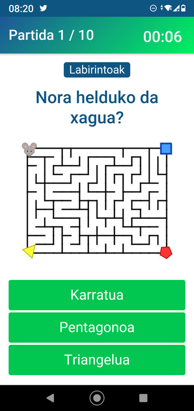
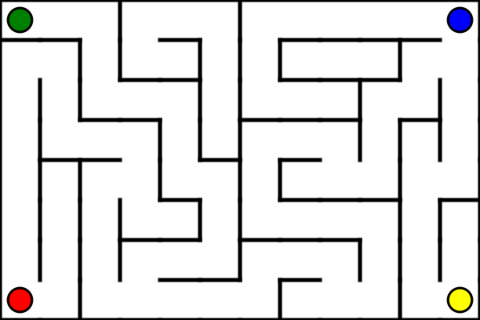

# Maze

A maze will be created at random, each edge will have a color. Starting from one of the four edges, there will be a path to the other edge, the system will have to find it.


## Create virtual environment

Although it is optional to create a virtual environment, it is a good idea to use a different environment (Conda or Virtualenv) to avoid problems with your system's Python environment. In this case, using virtualenv creates and activates a new environment.

```bash
python3 -m venv myvenv
source myvenv/bin/activate
```

Various libraries are used to create images and perform various operations. To install these, run the following.

```bash
pip install -r requirements.txt
```

## Create images

A depth-first search algorithm is used to create a maze. The maze consist of a grid of cells and each cell initially has four walls (North, East, South and West). Starting from a given cell, the aim is to produce a path visiting each cell according to the following procedure:

- Inspect the neighbouring cells. If any of them have yet to be visited, pick one and move at random into it by removing the wall between them.

- If no neighbouring cell is unvisited (a dead end), then backtrack to the last cell with an unvisited neighbour.

After we construct the maze, we have to add a wall so that there is only one possible exit from our starting point.

The size of the maze is controlled with parameters `nx`, `ny`. We can also select the starting point with parameter `start`. We can select the number of images that we want to generate with parameter `n`. These are the default parameters:

```bash
python create_images.py \
--nx 12 \
--ny 8 \
--start 0 \
--n 100 \
--output_path images
```

Images will be saved to `output_path` with a name that contains all the necessary data to create questions. The first digit correspond to the image index. The next two digits correspond to `nx` and `ny`. The next digits correspond to the startand end positions of the maze.

For example, the name for the following image is `fig_0_12_8_0_2.png`.



## Create questions

Questions are created for each image created previously in `image_path`. The data for the questions is obtained from the filename. Questions and correct answers are generated using this data. Wrong answers are created randomly based on the correct answer. A random integer in a range close to the correct answer is selected. Questions are saved in the `filename` csv file. These are the default parameters:

```bash
python create_questions.py \
--image_path images \
--filename questions.csv
```

4 questions of different types are created for each image.

- 3 questions about cell, column and row counts.
- 1 question about maze exit.

For example, these are the generated questions for the previous image.

| type | question                               | correct | wrong1 | wrong2 | image              |
| ---- | -------------------------------------- | ------- | ------ | ------ | ------------------ |
| Maze | How many cells?                        | 96      | 98     | 87     | fig_0_12_8_0_2.png |
| Maze | How many colums?                       | 12      | 11     | 9      | fig_0_12_8_0_2.png |
| Maze | How many rows?                         | 8       | 7      | 5      | fig_0_12_8_0_2.png |
| Maze | Which is the exit starting from green? | blue    | red    | yellow | fig_0_12_8_0_2.png |

## License

This code is licensed under [GNU General Public License v3.0](LICENSE). The code is based on https://github.com/gorka96/egunean_behin_labirintoa which is licensed under GNU GPL v3.0. It is also based on https://github.com/scipython/scipython-maths/tree/master/maze which is licensed under MIT license.